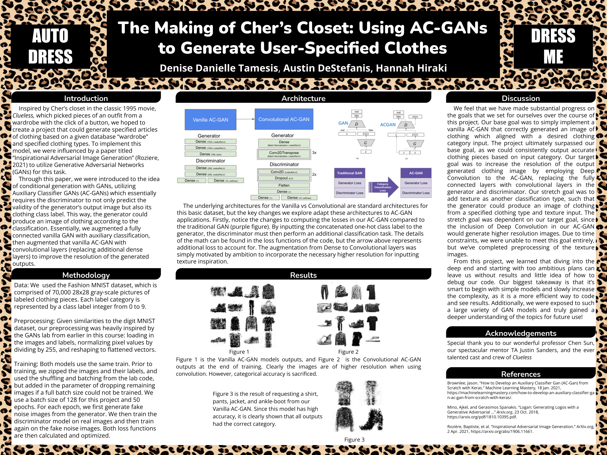
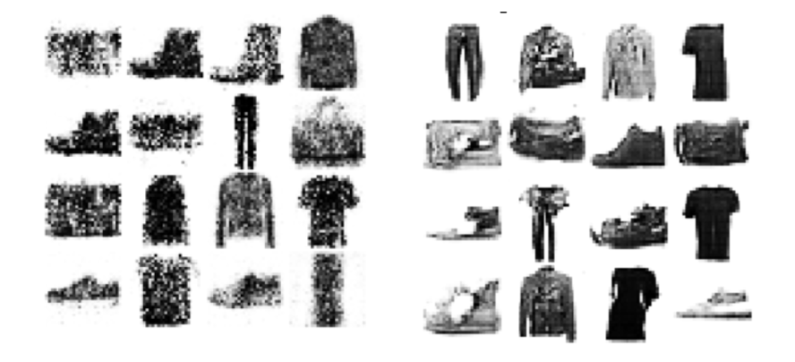
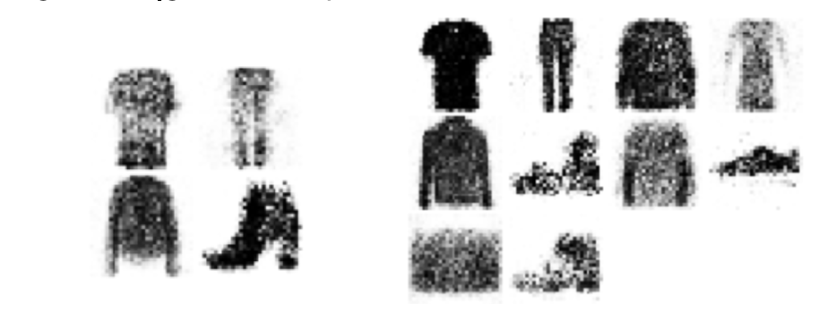

# The Making of Cher’s Closet: Using AC-GANs to Generate User-Specified Clothes
Denise Danielle Tamesis, Austin DeStefanis, and Hannah Hiraki

## Introduction

Inspired by Cher’s closet in the classic 1995 movie, *Clueless*, which picked pieces of an outfit from a wardrobe with the click of a button, we hoped to follow in its footsteps and create a project that could generate specified articles of clothing based on a given database “wardrobe” to ensure that users looked their absolute best strutting around their high school hallways like Cher. To implement this model, we were influenced by a paper titled “Inspirational Adversarial Image Generation” (Roziere, 2021) to utilize Generative Adversarial Networks (GANs) for this task. 

Through this paper, we were introduced to the idea of conditional generation with GANs, utilizing Auxiliary Classifier GANs (AC-GANs) which essentially requires the discriminator to not only predict the validity of the generator’s output image but also its clothing class label. This way, the generator could produce an image of clothing according to the classification. Essentially, we augmented a fully connected vanilla GAN with auxiliary classification, then augmented that vanilla AC-GAN with convolutional layers (replacing additional dense layers) to improve the resolution of the generated outputs. 

We found that this convolutional AC-GAN sacrificed classification accuracy for image resolution compared to the vanilla AC-GAN. Knowing this, we considered employing a commonly known pre-trained super resolution GAN (ESRGAN) to improve the resolution of the generated output from the vanilla AC-GAN post-training. In practice, the use of the second GAN to return higher resolution images to the user could be done in a hidden cell.

As next steps, we would take our preprocessed texture images and explore ways to use deep learning to learn texture classification and apply that information to the AC-GAN’s generated outputs. Unfortunately, due to time constraints (especially with GAN training runtimes) and limited access to mathematical understanding of the methodology for this texture input, we were unable to further augment our AC-GAN, but we do discuss our hypothetical approach later in this reflection. 

## Methodology

### Data

While we originally wanted to pursue a more robust fashion dataset, preprocessing troubles and legal accessibility issues led us to use the Fashion MNIST dataset, which is comprised of 70,000 28x28 gray-scale pictures of labeled clothing pieces. Each label category is represented by a class label integer from 0 to 9, with: 

class label | category
---|---
0|T-shirt/top
1|Trouser
2|Pullover
3|Dress
4|Coat
5|Sandal
6|Shirt
7|Sneaker
8|Bag
9|Ankle boot

### Preprocess

Due to the time constraint of working with difficult-to-train GANs, we prioritized building and augmenting our model with a dataset that required very little preprocessing: the **Fashion MNIST dataset**. Our intention was to transition our model, once built, to the **simpleFashion** dataset and/or the in-shop clothing images from the **deepFashion** dataset if time allowed. 

Given similarities to the digit MNIST dataset, our preprocessing was heavily inspired by the GANs lab from earlier in this course: loading in the images and labels, normalizing pixel values by dividing by 255, and reshaping to flattened vectors.

### Planning, Architecture, & Loss

Generally speaking, our methodology plan was as follows: Start with the simplest Vanilla GAN, change the loss and input to the generator to capture categorical classification, and once that model successfully turned into the AC-GAN we want, we planned to improve with “bonus features.” The first bonus feature we pursued was higher resolution because if the ultimate goal was to input inspiration image textures, then we needed higher resolution to see those textures on the clothes. That’s what inspired the use of convolutional layers. We did get to preprocess the texture dataset, but didn’t get to dive deep into the math behind the loss and implementation as input to the AC-GAN. Also, since we lost category classification accuracy when we implemented the Convolutional AC-GAN for higher resolution, we imported a pre-trained Super Resolution GAN (ESRGAN) model to consider the possibility of getting higher resolution after the Vanilla AC-GAN was trained and produced outputs. We would’ve tried using it as an intermediate model to get the low resolution output to higher resolution and use those images for working with the model that considered the texture inspiration aspect. We decided to keep these experimental thoughts in our Colab files to demonstrate where the next steps were headed, as well as our efforts to try different pooling methods to remove “splotchy” results.

For simplicity and readability, we will outline the model architectures for the different augmentation steps we were able to take:

#### 1) Vanilla AC-GAN Architecture:
 - batch_size = 128, noise_dim = 96, num_classes = 10
 - Generator
   - Dense layer with LeakyReLU, alpha of 0.01
     - Inputs [batch_size, noise_dim + num_classes]
     - Outputs [batch_size, 1024]
   - Dense layer with LeakyReLU, alpha of 0.01
     - Inputs [batch_size, 1024]
     - Outputs [batch_size, 1024]
   - Dense layer with tanh activation
     - Inputs [batch_size, 1024]
     - Outputs [batch_size, 784] generated pixel values from -1 to 1
 - Discriminator
   - Dense layer with LeakyReLU, alpha of 0.01
     - Inputs [batch_size, noise_dim + num_classes]
     - Outputs [batch_size, 1024]
   - Dense layer with LeakyReLU, alpha of 0.01
     - Inputs [batch_size, 1024]
     - Outputs [batch_size, 1024]
   - Dense layer with tanh activation
     - Inputs [batch_size, 1024]
     - Outputs [batch_size, 784] generated pixel values from -1 to 1
 #### 2) Convolutional AC-GAN:
- Generator
  - Dense layer to get initial feature maps according to latent noise with class
  - BatchNormalization
  - LeakyReLU
  - Reshape the input to size (7,7,26)
  - Conv2DTranspose layer
  - BatchNormalization
  - LeakyRelu
  - Conv2DTranspose layer
  - BatchNormalization
  - LeakyRelu
  - Conv2DTranspose layer
- Discriminator
  - Conv2D layer with LeakyReLU
  - Dropout layer with rate of 0.4
  - Conv2D layer with LeakyReLU
  - Dropout layer with rate of 0.4
  - Flatten layer
  - Dense layer
  - 2 Dense layers
  
#### IMPLEMENTATION CHANGES: 
The primary change relevant to our project to convert from GAN to AC-GAN was in the...

...**Input** as latent noise with random one-hot class label concatenated (inspired by the conditioning section of the “Inspirational Adversarial Image Generation” paper)

...**Loss**

The *Discriminator* needed to optimize not only correct binary predictions of real vs. fake images, but also correct classification, given the real label associated with the real image or the randomly generated label associated with the Generator output. With this conceptual understanding in mind, we calculated the binary-prediction-loss similarly to the lab by adding the loss of correctly predicting the fake images as fake and the loss of correctly predicting the real images as real. 

Then to calculate the classification-loss, we used sparse categorical cross entropy with logits (since the classes are mutually exclusive in our case), and added together the loss of correctly classifying the fake images and the loss of correctly classifying the real images. 

We then added together the binary-prediction-loss and the classification-loss for each image, and took the mean loss for the batch.

The *Generator* needed to optimize not only incorrect binary predictions of the Discriminator, but also correct classification of its generated outputs. We again calculated binary-prediction-loss similarly to the lab with the loss of incorrectly predicting the fake images as real. We then calculated the classification-loss exactly how it was calculated for the discriminator loss, and added these two losses together per image, and again outputted the mean for the batch.

### Training

Both models use the same train. Prior to training, we zipped the images and their labels, and used the shuffling and batching from the lab code, but added in the parameter of dropping remaining images if a full batch size could not be trained. We use a batch size of 128 for this project and 50 epochs. For each epoch, we first generate fake noise images from the generator. We then train the discriminator model on real images and then train again on the fake noise images. Both loss functions are then calculated and optimized.

Admittedly, there were some runs of train that experienced mode collapse, or cases where the different in the losses between the Discriminator and the Generator had gotten too large for the worse model to “catch up” in performance. For the sake of time, we simply restarted the runtime and tried again to produce results. Otherwise, we would have experimented with including some if statements in the training process to monitor certain loss thresholds and freezing either the Discriminator or the Generator for a certain number of epochs while the other trained. This is certainly something to explore after the semester.

## Results

Evaluating results with GANs is a bit challenging considering our discussion in class about how we don’t have something like “perplexity” to evaluate fake data. So instead, we used human evaluation of different criteria.

We evaluated the performance of our model by determining (1) if the outputted clothing image from the generator looks like a piece of clothing, and (2) if the image of clothing appears to match the classification given. The image below on the left is the Vanilla AC-GAN models outputs, and the one on the right is the Convolutional AC-GAN outputs at the end of training. Clearly the images are of higher resolution when using convolution.

The image on the left below is the result of requesting a shirt, pants, jacket, and ankle-boot from our Vanilla AC-GAN. All outputs appear to visually have the correct category, so this model has high accuracy with category classification. A nice feature to note is that since the model can take any “batch_size” as input, a user could ask for any number of clothing items at once. The image on the right below is the result of requesting all 10 class labels from our Vanilla AC-GAN, showing that the model will output different types of clothing per category with the same input class labels, demonstrating the true generator capabilities of our model.

When training the Vanilla AC-GAN, the discriminator loss remains around 4 and the generator loss remains around 3.
When training the Convolutional AC-GAN, both discriminator and generator loss remain around 5. For both models, we find the losses never drastically change and remain relatively constant throughout the training process, unless mode collapse occurred and one loss would get very large. However, as mentioned earlier, we did not properly deal with mode collapse for the sake of time and instead retrained.

Another thing to note is that the classification accuracy with our Vanilla AC-GAN was drastically higher than that of the Convolutional AC-GAN. That is, our implementation of the convolutional layers sacrificed classification accuracy for resolution. To explore the source of this problem, we’d consider adding in scaling factors to the loss, but we ran short on time.

## Challenges

We encountered many problems while trying to find a dataset that would meet all the needs for our project. Our criteria for the dataset included having a very large dataset size so we could train on more images, white backgrounds to simplify the image’s subject, clothing that were not worn by models so only the pieces would need to be generated, and front-facing items to, again, simplify generation. While some datasets had the potential to fulfill these criteria with thorough preprocessing, ultimately we prioritized shorter processing and reduced preprocess debugging and settled on the Fashion MNIST dataset.

When we first spearheaded the project, we were a bit too ambitious with including all the moving parts of our target goals, which made it extremely difficult to troubleshoot when we ran into dead ends. After consulting with our project TA, we decided to completely strip away many of the elements of the AC-GAN and DC-GAN model networks and start off with trying to train the generator to successfully produce images of clothing based on the inputted classification. Only then were we able to properly pinpoint the faults in our logic and create a model that worked, to any extent. 

Since the Fashion MNIST dataset pictures are extremely small (28x28), the images input into the discriminator have very low resolution, so it is difficult to output images of higher resolution from the generator after the models have trained. In order to reach our stretch goals of having not only a clothing category to classify but also a texture from the Describable Textures Dataset (DTD), we would need a high-resolution generated clothing image to properly assess the produced texture. We attempted to alleviate this concern by implementing a Convolutional AC-GAN, which successfully made our images of higher quality.

When training GANs, we often ran into problems that were discussed in lecture, such as mode collapse and generator loss skyrocketing in comparison to discriminator loss, which drastically affected the results of the training. We hope to implement suggested solutions for these problems in the future, but due to the short timeline of this project, we opted to restart training when these situations became apparent.

## References

Brownlee, Jason. “How to Develop an Auxiliary Classifier Gan (AC-Gan) from Scratch with Keras.” Machine Learning Mastery, 18 Jan. 2021, https://machinelearningmastery.com/how-to-develop-an-auxiliary-classifier-gan-ac-gan-from-scratch-with-keras/. 

“Lab 8: Generative Adversarial Nets” CSCI1470 Deep Learning, Brown University, 15 Nov. 2021, https://drive.google.com/drive/folders/1qupINFSHqtU7bko-xzytg-i-TSuipJdm?usp=sharing.

Rozière, Baptiste, et al. “Inspirational Adversarial Image Generation.” ArXiv.org, 2 Apr. 2021, https://arxiv.org/abs/1906.11661. 

## Reflection

**How do you feel your project ultimately turned out? How did you do relative to your base/target/stretch goals?**

We feel that we have made substantial progress on the goals that we set for ourselves over the course of this project. Our base goal was to simply implement a vanilla AC-GAN that correctly generated an image of clothing which aligned with a desired clothing category input. The project ultimately surpassed our base goal, as we could consistently output accurate clothing pieces based on input category. Our target goal was to increase the resolution of the output generated clothing image by employing Deep Convolution to the AC-GAN, replacing the fully connected layers with convolutional layers in the generator and discriminator. Our stretch goal was to add texture as another classification type, such that the generator could produce an image of clothing from a specified clothing type and texture input. The stretch goal was dependent on our target goal, since the inclusion of Deep Convolution in our AC-GAN would generate higher resolution images. Due to time constraints, we were unable to meet this goal entirely, but we’ve completed preprocessing of the texture images.

**Did your model work out the way you expected it to?**

Initially, when we had a very simple model architecture of the fully connected vanilla AC-GAN, the model properly worked in generating a clothing image with the same description as it’s appearance. However, we hoped the images would be more clear. Our AC-GAN with convolution was able to produce much higher resolution pictures and worked very similar to how we expected. We believe if we had higher resolution data we could have produced better results, however our results were expected with our dataset.

**How did your approach change over time? What kind of pivots did you make, if any?**

Before Checkpoint 2, we completely pivoted with the direction of our project, away from one that would identify a “fashionable score” for a given input of clothing items, to a completely new project that would use GANs to produce new pieces of clothing. Additionally, while our focus was originally on vanilla AC-GANs with the possibility of inputting texture inspiration, our model was not producing images of high enough resolution to potentially evaluate any learned texture, so we, again, were forced to pivot and produce Convolutional AC-GANs which utilize convolution to produce higher resolution images.

**Would you have done differently if you could do your project over again?**

If we could completely restart our project over again, we would have a more accurate understanding of the difficulty of our project and the proper steps to take. For example, if we would have started with a simple GAN model first, it probably would have been easier for us to incrementally increase the complexity of our model. If we could do the project over again, we would have started with this simple GAN and slowly increased the complexity, which would have allowed us to manage our time better and most likely end up with more complex results.

**What do you think you can further improve on if you had more time?**

If we had more time to spend developing this project, we would implement many changes. For one, we would want to choose a more complex dataset that begins with higher resolution images that are colored. Next, we would improve the convolutional AC-GANAdditionally, we would have liked to reach our stretch goal of inputting a texture that inspires our generated clothing item’s texture.

**What are your biggest takeaways from this project/what did you learn?**

From this project, we learned that diving into the deep end and starting with too ambitious plans can leave us without results and little idea of how to debug our code. Our biggest takeaway is that it’s smart to begin with simple models and slowly increase the complexity, as it is a more efficient way to code and see results. Incremental additions also allow us to focus more on each part and how they piece together conceptually. Additionally, we were exposed to such a large variety of GAN models and truly gained a deeper understanding of the topics for future use!
